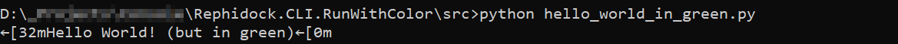
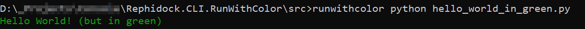

# RunWithColor

[](https://github.com/Rephidock/Rephidock.CLI.RunWithColor/blob/main/LICENSE)

A CLI utility to enable ANSI escape sequences in windows command prompt (cmd, conhost).

## About

By default the command prompt treats ANSI escape sequences as text, hence why they visibly appear.

For the escape sequences to be treated as actions the program running can enable `ENABLE_VIRTUAL_TERMINAL_PROCESSING` flag during execution, however some programs do not.

This tool is a workaround that enables that flag for them.

*The name of the tool comes from the wide use of the escape sequences to color text.*

## Example

In this example the project was built as a single executable,  renamed to `runwithcolor.exe` and added to PATH.

The following [python code](src/hello_world_in_green.py) is run in the terminal:
```py
print("\x1b[32mHello World! (but in green)\x1b[0m")
```

Normal execution:


Execution using the tool:
